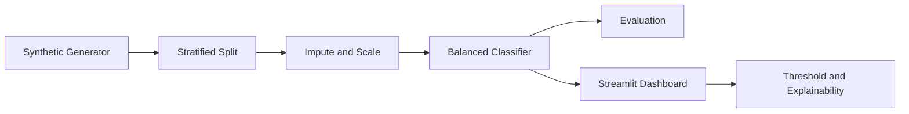

# AI Diabetes Risk Dashboard

Interactive Streamlit dashboard that demonstrates an end-to-end machine-learning workflow for diabetes risk screening using **synthetic data only**. It includes preprocessing, leakage-safe training, class-imbalance handling, probability calibration, threshold tuning, explainability, and model-monitoring views.

> Educational portfolio project only. It is not a medical device and must not be used for diagnosis, treatment, or clinical decision-making.

## Business problem

Screening datasets often contain missing values, imbalanced outcomes, inconsistent feature scales, and metrics that hide poor minority-class performance. The project demonstrates how to build a transparent risk-model workflow that exposes those limitations rather than presenting accuracy alone.

## Issues solved

- **Missing values:** median imputation inside the training pipeline
- **Data leakage:** preprocessing is fit only on training folds
- **Class imbalance:** balanced logistic-regression weights
- **Misleading accuracy:** ROC-AUC, precision, recall, F1 and confusion matrix
- **Fixed decision cutoff:** adjustable dashboard threshold
- **Low interpretability:** feature contribution and coefficient views
- **Privacy risk:** reproducible synthetic-data generator; no patient records committed

## Architecture



## Run

```bash
python -m venv .venv
source .venv/bin/activate
pip install -r requirements.txt
streamlit run dashboard.py
```

## Dashboard

The interface provides cohort metrics, ROC and precision-recall curves, a confusion matrix, adjustable risk thresholds, feature distributions, and a single-record demonstration. Metrics are generated at runtime and are not presented as clinical performance claims.

