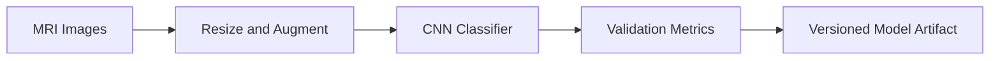

# Alzheimer's MRI Classification Research Scaffold

Reproducible deep-learning scaffold for multi-class MRI image classification. It includes data validation, transfer learning, class weighting, callbacks, evaluation metrics, and a synthetic smoke-test mode.

This repository does **not** include patient images or make clinical claims. It is an engineering companion for research; it is not a diagnostic medical device.

## Dataset layout

```text
data/
  train/<class_name>/*.jpg
  val/<class_name>/*.jpg
```

## Run a smoke test

```bash
python -m venv .venv
source .venv/bin/activate
pip install -r requirements.txt
python train.py --synthetic --epochs 1
```

## Train on an approved dataset

```bash
python train.py --data-dir data --epochs 20 --output-dir artifacts
```

The pipeline saves the best Keras model and training history. Validate external datasets, consent, licensing, and bias before any research use.
## Architecture



## Research outcome

The related graduate research reported 98.37% accuracy on its study dataset. This repository is a reproducible engineering scaffold; results must be independently reproduced and clinically validated before use.
