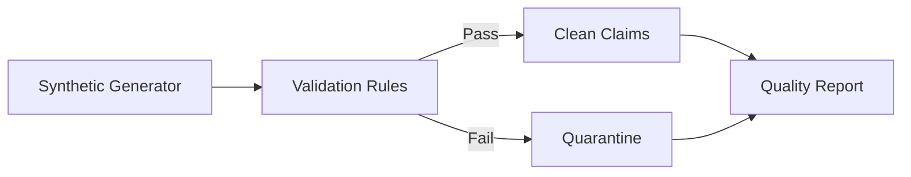

# Healthcare Data Quality Pipeline

Configurable validation pipeline for synthetic healthcare claim records. It detects missing identifiers, invalid amounts, malformed diagnosis codes, duplicate claims, and impossible service-date sequences, then writes clean and quarantined outputs with a quality report.

> The included data is synthetic and contains no PHI.

## Run

```bash
python -m venv .venv
source .venv/bin/activate
pip install -r requirements.txt
python generate_sample.py --output data/sample_claims.csv
python pipeline.py --input data/sample_claims.csv --output output
pytest
```

## Outputs

- `clean_claims.csv` — accepted records
- `quarantined_claims.csv` — rejected records and reason codes
- `quality_report.json` — row counts and rule-level failures

The generator creates synthetic records locally. No member-level dataset is stored in this public repository.
## Architecture



## Demo result

The automated test verifies valid/invalid routing and reason-code capture. Run the generator and pipeline to produce reproducible rule-level quality metrics locally.
